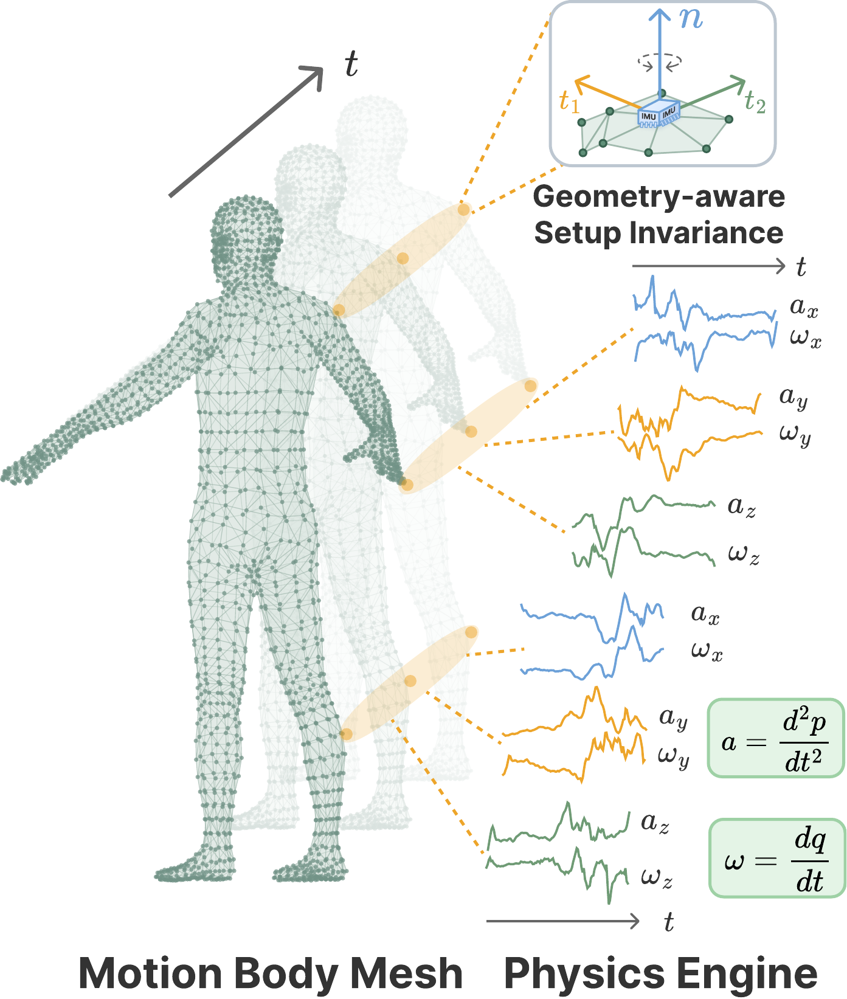
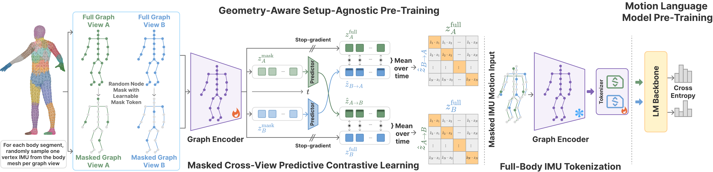
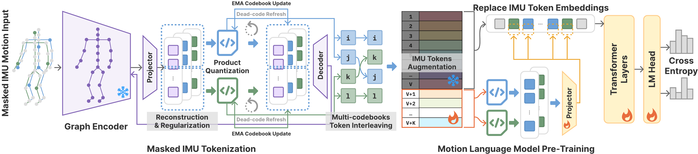
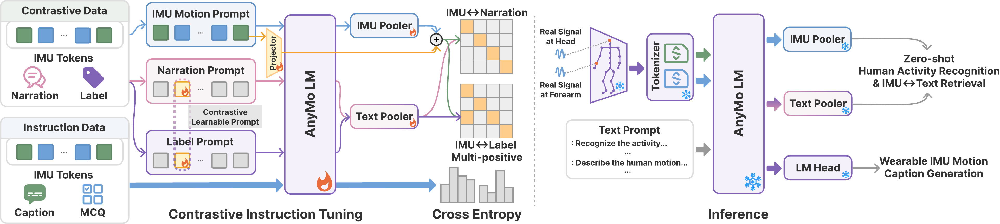
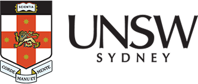
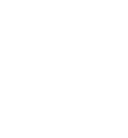

<div align="center">
  <h1><b>AnyMo: Geometry-Aware Setup-Agnostic Modeling of Human Motion in the Wild</b></h1>
</div>

<div align="center">

### [Baiyu Chen](https://baiyuchen.com/)<sup>1,2</sup>, [Zechen Li](https://zechenli03.github.io/)<sup>1</sup>, [Wilson Wongso](https://wilsonwongso.dev/)<sup>1,2</sup>, [Lihuan Li](https://scholar.google.com/citations?user=1FsFOXwAAAAJ)<sup>1,2</sup>, [Xiachong Lin](https://scholar.google.com/citations?user=wDfgGDkAAAAJ)<sup>1</sup>, [Hao Xue](https://haoxue01.github.io/)<sup>1,2,3,4</sup>, [Benjamin Tag](https://www.unsw.edu.au/staff/benjamin-tag)<sup>1</sup>, and [Flora Salim](https://fsalim.github.io/)<sup>1,2</sup>

<sup>1</sup> School of Computer Science and Engineering, UNSW Sydney, Australia<br/>
<sup>2</sup> ARC Centre of Excellence for Automated Decision-Making and Society<br/>
<sup>3</sup> The Hong Kong University of Science and Technology (Guangzhou)<br/>
<sup>4</sup> The Hong Kong University of Science and Technology

[](https://arxiv.org/abs/2605.22715)
[](https://baiyuchen.com/project/AnyMo)
[](https://huggingface.co/datasets/CRUISEResearchGroup/AnyMo-Bench)
[](https://www.python.org/downloads/release/python-3100/)
[](https://pytorch.org/)

</div>

AnyMo models wearable setup variation through body geometry. It simulates IMUs over dense body-surface placements, learns setup-stable full-body motion representations from sparse observations, discretizes them into compact IMU tokens, and aligns the tokens with a language model for zero-shot recognition, retrieval, and captioning.

## 📑 Table of Contents

- [Overview](#overview)
- [Project Structure](#project-structure)
- [Main Results](#main-results)
- [Installation](#installation)
- [Paths and Runtime Configuration](#paths-and-runtime-configuration)
- [AnyMo-Bench](#anymo-bench)
- [Reproducing AnyMo](#reproducing-anymo)
- [Nymeria Held-Out Protocol](#nymeria-held-out-protocol)
- [Citation](#citation)
- [License and Acknowledgements](#license-and-acknowledgements)
- [Contact](#contact)

<a id="overview"></a>
## 🌟 Overview

<p align="center">
  <br/>
  <em>Physics-grounded geometry-aware motion simulation.</em>
</p>

<p align="center">
  <br/>
  <em>Geometry-aware pre-training, full-body IMU tokenization, and motion language model pre-training.</em>
</p>

<p align="center">
  <br/>
  <em>Masked IMU tokenization and motion language model pre-training.</em>
</p>

<p align="center">
  <br/>
  <em>Contrastive instruction tuning (left) and inference phases (right) of AnyMo.</em>
</p>

The public pipeline follows the paper's four stages:

1. synchronize Nymeria IMU, Xsens, mesh, and text streams and synthesize dense body-surface IMUs;
2. pretrain the 23-node spatio-temporal graph encoder with masked cross-view predictive-contrastive learning;
3. train the product-quantized VAE and export full-body IMU-token corpora;
4. perform motion-language pretraining and multi-task contrastive instruction tuning.

<a id="project-structure"></a>
## 📂 Project Structure

```text
AnyMo/
├── README.md
├── LICENSE
├── requirements.txt
├── code/                     Models, training, and evaluation
│   ├── exporters/            Corpus and evaluation-data exporters
│   ├── nymeria_sync/         Nymeria synchronization implementations
│   ├── simulation/           Body-surface placement and IMU simulation stages
│   ├── WIMUSim/              WIMUSim used by the geometry-aware simulator
│   └── ms-swift/             ms-swift used for motion-language training
├── metadata/
├── scripts/
└── assets/
```

<a id="main-results"></a>
## 📊 Main Results

Across 14 unseen HAR datasets, AnyMo improves average Accuracy/F1/R@2 over the strongest prior baseline by **11.7%/11.6%/22.6%**. On zero-shot EgoExo4D, it improves IMU-to-text and text-to-IMU retrieval MRR by **15.9%** and **28.6%**, and captioning BERT-F1 by **18.8%**. See the [paper](https://arxiv.org/abs/2605.22715) for complete per-dataset results and evaluation protocols.

<a id="installation"></a>

## 🛠️ Installation

Python 3.10 is recommended. The model-training and simulation stages use separate reference environments because the released WIMUSim/PyTorch3D stack targets an earlier PyTorch version.

### 🧠 Model Training and Evaluation

The released AnyMo checkpoints were trained and evaluated with PyTorch 2.10.0, torchvision 0.25.0, torchaudio 2.10.0, CUDA 12.8, and FlashAttention 2.8.3.

```bash
bash scripts/setup_environment.sh model
conda activate anymo
```

### 🧭 Geometry-Aware Simulation

The geometry-aware IMU data were generated with PyTorch 2.0.1, torchvision 0.15.2, torchaudio 2.0.2, CUDA 11.7, and PyTorch3D 0.7.7. To reproduce this stage exactly, use a separate environment:

```bash
bash scripts/setup_environment.sh simulation
conda activate anymo-sim
```

Pass an optional second argument to choose another environment name, for example `bash scripts/setup_environment.sh model my-anymo-env`.

Nymeria preprocessing additionally requires the [official Nymeria tools](https://github.com/facebookresearch/nymeria_dataset) and their dependencies, including Project Aria Tools. Clone/install that repository following its documentation, then point `NYMERIA_TOOLS_ROOT` to the repository directory whose immediate child is the `nymeria/` Python package:

```text
<PATH_TO_NYMERIA_TOOLS>/
└── nymeria/
    ├── data_provider.py
    ├── body_motion_provider.py
    └── recording_data_provider.py
```

The official tools are required only for the Nymeria synchronization in Step 1 and surface-candidate extraction at the start of Step 2. The later simulation, model training, corpus export, and evaluation stages operate on the prepared files and do not import the Nymeria package. Dataset access remains subject to each dataset's license and terms.

<a id="paths-and-runtime-configuration"></a>
## ⚙️ Paths and Runtime Configuration

Set the Nymeria data path before running the main pipeline:

```bash
export ANYMO_DATA_ROOT=<PATH_TO_NYMERIA>
export NYMERIA_TOOLS_ROOT=<PATH_TO_NYMERIA_TOOLS>
```

`ANYMO_DATA_ROOT` is required for Nymeria preparation, simulation, encoder/tokenizer training, and corpus export. `NYMERIA_TOOLS_ROOT` is required only for Nymeria synchronization and surface-candidate extraction; it must be the parent directory of the `nymeria/` package, not the dataset directory.

Output, cache, and GPU settings are optional:

```bash
export ANYMO_OUTPUT_ROOT=<PATH_TO_ANYMO_OUTPUTS>  # default: ./outputs
export ANYMO_CACHE_ROOT=<PATH_TO_MODEL_CACHE>     # default: ./.cache
export CUDA_VISIBLE_DEVICES=0,1                   # choose visible GPUs
export NPROC_PER_NODE=2                           # default: 1
```

Adjust `CUDA_VISIBLE_DEVICES` and `NPROC_PER_NODE` for the available hardware, or leave them unset for the defaults.

Data preparation uses three unified command-line entry points:

```bash
python code/sync_nymeria.py --help
python code/simulate.py --help
python code/export.py --help
```

Use `<command> --help`, such as `python code/export.py har --help`, for stage-specific options.

<a id="anymo-bench"></a>
## 🤗 AnyMo-Bench

AnyMo-Bench contains 154,695 activity windows from 196 participants (211.6 hours), synchronized at 60 Hz. Each `imu` array has shape `[T, 18]`, with `T <= 300`: three-axis acceleration and angular velocity at the head, left wrist, and right wrist. Four label/configuration variants are available.

```python
from datasets import load_dataset

dataset = load_dataset(
    "CRUISEResearchGroup/AnyMo-Bench",
    "AnyMo-Bench-150-US",
)
sample = dataset["train"][0]
print(len(sample["imu"]), len(sample["imu"][0]), sample["label"])
```

The available configurations are `AnyMo-Bench-150-US`, `AnyMo-Bench-150-USCD`, `AnyMo-Bench-50-US`, and `AnyMo-Bench-50-USCD`. Refer to the [dataset card](https://huggingface.co/datasets/CRUISEResearchGroup/AnyMo-Bench) for split definitions and licensing.

AnyMo-Bench provides the finalized activity labels used by the released pipeline. The internal label-generation, clustering, and LLM-adjudication workflow is not required to reproduce the AnyMo models or reported evaluations and is therefore not included in this repository.

<a id="reproducing-anymo"></a>
## 🚀 Reproducing AnyMo

### 1. 📥 Nymeria Preparation

Arrange the authorized Nymeria release under `ANYMO_DATA_ROOT`, set `NYMERIA_TOOLS_ROOT` as described above, then synchronize the signals, body motion, mesh, and narrations:

```bash
bash scripts/prepare_nymeria.sh
```

### 2. 🧭 Geometry-Aware IMU Simulation

This stage selects candidate vertices for 23 anatomical segments, constructs tangent/binormal/normal local sensor frames, simulates signals using the bundled WIMUSim implementation, and stores the generated arrays in the training format. The initial candidate-selection command uses the official Nymeria body-motion provider; the remaining simulation commands use the prepared mesh arrays and bundled WIMUSim:

The complete dense synthetic dataset covers 831 Nymeria recordings and all 2,374 candidate body-surface placements, occupying approximately 2.1 TB in Zarr format. Due to its size, the precomputed synthetic arrays are not hosted in this repository and should be generated locally using the provided pipeline.

```bash
bash scripts/simulate_imu.sh
```

### 3. 🧠 ST-GCN Pretraining

```bash
bash scripts/train_encoder.sh
```

The release defaults reproduce the main setup: 60 Hz, five-second windows, at most five visible segments, batch size 64, 10 epochs, learning rate `3e-4`, and InfoNCE temperature `0.1`.

### 4. 🧩 PQ-VAE Tokenization

```bash
bash scripts/train_tokenizer.sh
```

The tokenizer uses two 2,048-entry codebooks, 64-dimensional code vectors, a 128-dimensional bottleneck, and EMA decay `0.99`.

### 5. 📦 Corpus Export

Set the external dataset roots needed for the 14-dataset benchmark, then run:

```bash
bash scripts/export_corpora.sh
```

The HAR pipeline is scoped to the datasets reported in the paper: PAMAP, USC-HAD, UCI-HAR, Opportunity, WISDM, DSADS, UTD-MHAD, w-HAR, RealWorld, TNDA-HAR, Ego4D, MMEA, EgoExo4D, and OpenPack.

This exports the IMU-token pretraining corpus, narration/MCQ/contrastive instruction corpus, 14-dataset HAR evaluation tokens, Nymeria held-out retrieval/captioning data, and EgoExo4D zero-shot data.

### 6. 💬 Motion-Language Pretraining

```bash
bash scripts/pretrain_llm.sh
```

The paper uses Qwen2.5-0.5B for three epochs with learning rate `1e-4` and batch size 16.

### 7. 🔗 Contrastive Instruction Tuning

```bash
export ANYMO_PRETRAINED_CHECKPOINT=<PATH_TO_PRETRAINED_CHECKPOINT>
bash scripts/instruction_tuning.sh
```

The final stage jointly trains narration, label, and MCQ objectives with the paper configuration.

### 8. 📈 Evaluation

```bash
export ANYMO_CHECKPOINT=<PATH_TO_FINAL_ANYMO_CHECKPOINT>
bash scripts/evaluate.sh
```

The script runs the paper's learned-prompt embedding evaluation for zero-shot HAR, 100-candidate and full-set bidirectional retrieval for held-out Nymeria and zero-shot EgoExo4D, and full-set caption generation/scoring. Generated files are written below `ANYMO_OUTPUT_ROOT`.

<a id="nymeria-held-out-protocol"></a>
## 🧪 Nymeria Held-Out Protocol

The following five participants are completely excluded from AnyMo training and used only for held-out real-IMU evaluation:

```text
alec_meza
bradley_herman
dominique_frye
justin_ramirez
kyle_parker
```

Their records are excluded from synthetic representation pretraining, tokenizer training, text-aligned token export, instruction tuning, and motion-language training. Their 20 held-out recordings cover all 20 original Nymeria scenarios and contain 3,908 text-aligned real-IMU windows for retrieval and captioning evaluation. EgoExo4D is a fully unseen zero-shot test.

<a id="citation"></a>
## 📝 Citation

```bibtex
@article{chen2026anymo,
  title   = {AnyMo: Geometry-Aware Setup-Agnostic Modeling of Human Motion in the Wild},
  author  = {Chen, Baiyu and Li, Zechen and Wongso, Wilson and Li, Lihuan and Lin, Xiachong and Xue, Hao and Tag, Benjamin and Salim, Flora},
  journal = {arXiv preprint arXiv:2605.22715},
  year    = {2026}
}
```

<a id="license-and-acknowledgements"></a>
## ⚖️ License

AnyMo-specific code is released under the [MIT License](LICENSE). The bundled `code/ms-swift` and `code/WIMUSim` directories retain their original license and attribution files. AnyMo-Bench and source datasets are governed by their respective dataset licenses and access terms.

<a id="contact"></a>
## 📩 Contact

For questions or suggestions, please contact [Baiyu (Breeze) Chen](https://baiyuchen.com/) at `breeze.chen(at)unsw(dot)edu(dot)au`.

<p align="center">
  <a href="https://www.unsw.edu.au/"></a>
  &nbsp;&nbsp;&nbsp;
  <a href="https://www.admscentre.org.au/"></a>
  &nbsp;&nbsp;&nbsp;
  <a href="https://www.admscentre.org.au/"></a>
  &nbsp;&nbsp;&nbsp;
  <a href="https://www.hkust-gz.edu.cn/"></a>
</p>
